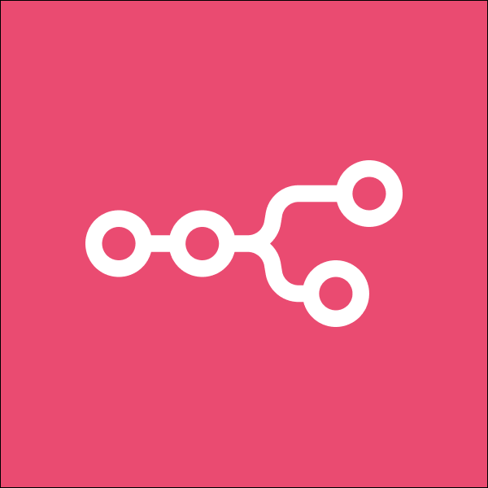

 <!-- ============================================================= -->
<!-- ✨ HEADER -->
<!-- ============================================================= -->
<h1 align="center">Hi, I'm <b>Vishal Lakshmi Narayanan</b></h1>
<h3 align="center">Data Science Enthusiast | AI Systems Builder | Full-Stack Engineer</h3>

I love turning complex problems into simple, intelligent solutions. 
Exploring how AI, analytics, and real-world data can work together to drive innovation and make technology more human.

---

<!-- ============================================================= -->
<!-- 🌐 CONNECT -->
<!-- ============================================================= -->
<h2 align="center">Connect with Me</h2>

  &nbsp;&nbsp;
  

---

<!-- ============================================================= -->
<!-- 🧠 LANGUAGES & TOOLS BOXED SECTIONS -->
<!-- ============================================================= -->
<h2 align="center">Languages & Tools</h2>

  
  

    
    
    
    
    
    
   
    
    
    
    
    
    
    
   
    
    
    
    
    
    
    
     
    
    
   
  

<!-- ============================================================= -->
<!-- 📈 GITHUB STATS -->
<!-- ============================================================= -->
<h2 align="center">GitHub Analytics</h2>

  
  
  

---

<!-- ============================================================= -->
<!-- ⚡ ACTIVITY GRAPH -->
<!-- ============================================================= -->
<h2 align="center">Recent Activity</h2>

  

---

i dont want boxes a single languages tool
